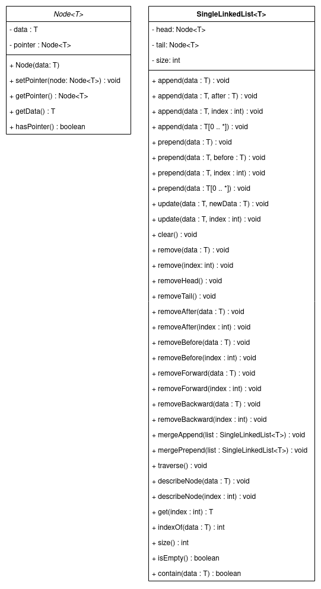

## Buatlah Single Linked List Berdasarkan Class Diagram Berikut
#

<p align="center"></p>

Kemudian buatlah `class` yang memuat `main method` untuk melakukan operasi dari `method` yang berada pada `class SingleLinkedList<T>` dengan ketentuan sebagai berikut :
1. `append(data : T)` : menambahkan `node` dengan data `data` di akhir `list`.
2. `append(data : T, after : T)` : menambahkan `node` dengan data `data` setelah node dengan data `after`, jika `after` tida ada, maka `data` akan ditambahkan di akhir `list`.
3. `append(data : T, index : int)` : memambahkan `node` dengan `data` setelah `node` yang berada pada indeks `index`, jika `index` tidak ada, maka `data` akan ditambahkan di akhir `list`.
4. `append(datas : T[0 .. *])` : menambahkan semua data `datas` di akhir `list`.
5. Semua `method prepend` memiliki fungsi yang sama dengan `method append`, hanya saja penambahan terjadi di awal `list`.
6. setiap pemanggilan `append` dan `prepend`, maka atribut `size` akan bertambah 1.
7. `update(data : T, newData : T)` : mengganti data `node` yang memiliki data `data` dengan `newData`, jika `data` tidak ada, maka buatlah `NoSuchElementException`.
8. `update(data : T, index : int)` : mengganti data `node` yang berada pada indeks `index` dengan data `data`, jika `index` tidak ada, maka buatlah `IndexOutOfBoundsException`.
9. `clear()` : menghapus semua `node` dari `list`.
10. `remove(data : T)` : menghapus `node` yang memiliki data `data`, jika `data` tidak ada, maka buatlah `NoSuchElementException`.
11. `remove(index : int)` : menghapus `node` pada indeks `index`, jika `index` tidak ada, maka buatlah `IndexOutOfBoundsException`.
12. `removeHead()` : menghapus `node` `head`.
13. `removeTail()` : menghapus `node` `tail`.
14. `removeAfter(data : T)` : menghapus `node` setelah `node` dengan data `data`, jika `data` tidak ada, maka buatlah `NoSuchElementException`.
15. `removeAfter(index : int)` : menghapus `node` setelah `node` yang berada pada indeks `index`, jika `index` tidak ada, maka buatlah `IndexOutOfBoundsException`.
16. semua `method removeBefore` memiliki fungsi yang sama dengan `method removeAfter`, hanya saja proses penghapusan terjadi sebelum `data` atau `index`.
17. `removeForward(data : T)` : menghapus semua `node` yang berada setelah `node` dengan data `data`, jika `data` tidak ada, maka buatlah `NoSuchElementException`,
18. `removeForward(index : int)` : menghapus semua `node` setelah `node` yang berada pada indeks `index`, jika `index` tidak ada, maka buatlah `IndexOutOfBoundsException`.
19. Semua `method removeBackward` memeiliki fungsi yang sama dengan `method removeForward`, hanya saja proses penghapusan terjadi sebelum `data` atau `index`.
20. `mergeAppend(list : SingleLinkedList<T>)` : menggabungkan `list` setelah `list` yang sudah ada.
21. `mergePrepend(list : SingleLinkedList<T>)` : menggabungkan `list` sebelum `list` yang sudah ada.
22. `traverse()` : mencetak semua data `node` dari `list` dengan format :
    ```
    [data] -> [data] -> ... -> null
    ```
23. `traverseFrom(data : T)` : mencetak semua data `node` dari `list`, dimulai dari `node` yang memiliki data `data` sampai `tail`, jika `data` tidak ada, maka buatlah `NoSuchElementException`, format cetak sama dengan `traverse()`.
24. `traverseFrom(index : int)` : memiliki fungsi yang sama dengan `traverseFrom(data : T)`, namun proses cetak dimulai dari `node` dengan indeks `index`, jika `index` tidak ada, maka buatlah `IndexOutOfBoundsException`.
25. `describeNode(data : T)` : mencetak indeks dan data dari `node` yang memilik data `data`, jika data tidak ada, maka buatlah `NoSuchElementException`, format cetak : 
    ```
    {
      "data" : data,
      "index" : index
    }
    ```
    
26. `describeNode(index : int)` : memiliki fungsi yang sama dengan `describeNode(data : T)`, namun menggunakan `node` dengan indeks `index`, jika `index` tidak ada, maka buatlah `IndexOutOfBoundsException`.
27. `get(index : int) : T` : mengembalikan data dari `node` pada indeks `index`, jika `index` tidak ada, maka buatlah `IndexOutOfBoundsException`.
28. `indexOf(data : T) : int` : mengembalikan indeks dari `node` dengan data `data`, jika `data` tidak ada, maka buatlah `NoSuchElementException`.
29. `size() : int` : mengembalika atribut `size` dari class `SingleLinkedList`.
30. `isEmpty() : boolean` : mengembalikan `true` jika atribut `size` bernilai 0.
31. `contain(data : T) : boolean` : mengembalikan `true` jika pada `list` terdapat `node` dengan data `data`, jika `data` tidak ada, maka buatlah `NoSuchElementException`.

Atribut data pada `class Node<T>` akan memiliki tipe data `T`, dimana `T` ditentukan saat melakukan instansiasi dari `class SingleLinkedLis<T>`, contoh :
```java
SingleLinkedList<String> listString = new SingleLinkedList<>();
// listString hanya dapat menampung Node dengan tipe data String\
listString.append("Hello");

SingleLinkedList<Integer> listInt = new SingleLinkedList<>();
// listInt hanya dapat menampung Node dengan tipe data Integer
listInt.append(9);

SingleLinkedList<Double> listDouble = new SingleLinkedList<>();
// listDouble hanya dapat menampung Node dengan tipe data Double
listDouble.prepend(3.14);

SingleLinkedList<YourClass> listYourClass = new SingleLinkedList<>();
// listYourClass hanya dapat menampung Node dengan tipe data YourClass'
listYourClass.prepend(new YourClass());
```
Jika gambar `Class Diagram` diatas kurang jelas, silahkan unduh [SingleLinkedList.pdf](assets/SingleLinkedList.pdf "Class Diagram SingleLinkedList").